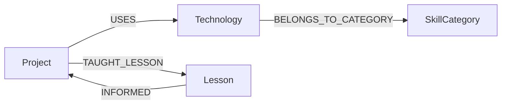

[Live demo](https://devtrace-nine.vercel.app/) | [Screen recording](https://youtu.be/lpoID1BDeOQ)

# DevTrace - an engineering decision graph built on CognoDB

## What this is

DevTrace is a graph of my own engineering history, not a generic CRUD demo. It captures three real projects from different points in that history - Beggy, PyLedger, and UR-AIR - along with the technologies I chose for each and the lessons that carried forward.

The seeded graph uses the actual project summaries and lesson notes from `src/lib/queries/seed-data.ts`, so the application shows a concrete sequence of decisions: Beggy as a full-stack intelligent travel packing assistant in a Turborepo monorepo, PyLedger as a double-entry accounting engine in an async Python monorepo, and UR-AIR as a NestJS + MongoDB anime/quotes REST API.

## Why a graph database?

The assignment's core question is not just "what did I use?" but "which technology choices were a direct reaction to a lesson from an earlier project, and which of those lessons informed something even later?" In a relational schema, that means joining projects to lessons, joining lessons to an `informed_by`-style link table, and then recursively walking those links if you want arbitrary-depth chains. That is doable, but it quickly turns into a recursive CTE with repeated self-joins and path reconstruction logic.

CognoDB makes the same question natural to ask in one pattern. The concrete implementation is `getInfluenceChains` in `src/lib/queries/influence.ts`, which uses a single variable-length path query:

```cypher
MATCH path = (start:Project)-[:TAUGHT_LESSON|INFORMED*1..${maxDepth * 2}]->(end:Project)
WHERE start <> end
RETURN path
LIMIT 25
```

That is the graph-native version of the brief's `[:TAUGHT_LESSON|INFORMED*1..N]` pattern. Instead of manually enumerating every possible hop count, the query asks CognoDB to walk the chain for me and return the full path.

## Data model



Seed data size:

- 3 projects
- 22 technologies
- 6 lessons
- 6 skill categories

## Tech stack

- Next.js 16 with the App Router and API routes in the same project, so there is no separate Express backend.
- React 19
- Tailwind CSS v4
- TypeScript
- `neo4j-driver` for openCypher over Bolt against CognoDB
- Zod for input validation
- Vitest and Testing Library for tests

## Setup instructions

### Prerequisites

- Node.js
- pnpm

### Create a CognoDB instance from scratch

1. Sign up at [console.cognodb.com/signup](https://console.cognodb.com/signup).
2. Create a free `c0` instance.
3. Copy the `bolt+s://` URI and the generated password for user `cognodb` when it is shown.

### Install dependencies

```bash
pnpm install
```

### Configure environment variables

Copy `.env.example` to `.env.local` and fill in the values for the variables defined there:

```bash
cp .env.example .env.local
```

The required variables are:

- `COGNODB_URI`
- `COGNODB_USERNAME`
- `COGNODB_PASSWORD`

### Load the graph

```bash
pnpm seed
```

`scripts/seed.ts` is idempotent and safe to re-run. It verifies connectivity, clears the current graph with `MATCH (n) DETACH DELETE n`, recreates the `Project`, `Technology`, `SkillCategory`, and `Lesson` nodes, creates the `USES`, `BELONGS_TO_CATEGORY`, `TAUGHT_LESSON`, and `INFORMED` relationships, and then creates the lookup indexes used by the app.

### Run the app

```bash
pnpm dev
```

The app runs at [http://localhost:3000](http://localhost:3000).

### Run tests

```bash
pnpm test
```

## API routes

| Method | Path                           | Returns                                                                                            |
| ------ | ------------------------------ | -------------------------------------------------------------------------------------------------- |
| GET    | `/api/projects`                | All projects, ordered by `startedAt`.                                                              |
| GET    | `/api/projects/[id]`           | One project by id, or `404` if it does not exist.                                                  |
| GET    | `/api/projects/[id]/influence` | Lessons from earlier projects that influenced the selected project's technology choices.           |
| GET    | `/api/projects/[id]/taught`    | Lessons taught by the selected project that informed a later project.                              |
| GET    | `/api/chains`                  | Serialized influence chains as JSON-safe `{ nodes, steps }` paths.                                 |
| GET    | `/api/categories`              | All skill categories with a technology count for each.                                             |
| GET    | `/api/categories/[id]`         | One category plus the technologies and projects associated with it, or `404` if it does not exist. |
| GET    | `/api/health`                  | A fast connectivity check that reports whether CognoDB is reachable.                               |

## The two required queries, explained

### Multi-hop traversal (`getProjectInfluence`)

This query answers: "For this project, which lessons from earlier projects show up in the technology choices I made here?" It is exactly three hops because it walks from an earlier project to a lesson it taught, from that lesson to the target project that was informed by it, and then from that target project to the technology that project uses.

```cypher
MATCH (earlier:Project)-[:TAUGHT_LESSON]->(l:Lesson)-[:INFORMED]->(target:Project {id: $projectId})-[:USES]->(t:Technology)
RETURN l.title AS lessonTitle, earlier.name AS fromProject, t.name AS technology
```

In plain language, this returns rows like "a lesson from Beggy influenced PyLedger, and PyLedger used this technology." It is a bounded, fixed-depth traversal, so it is easy to render directly in the UI.

### Variable-length path (`getInfluenceChains`)

This query answers a broader question: "What are all the influence chains between projects, up to a maximum depth?" That is the awkward case for a relational database, because you do not know ahead of time how many repeated joins you need. In SQL, this becomes recursive CTE territory, plus path assembly. In CognoDB, it is a single variable-length path pattern.

```cypher
MATCH path = (start:Project)-[:TAUGHT_LESSON|INFORMED*1..${maxDepth * 2}]->(end:Project)
WHERE start <> end
RETURN path
LIMIT 25
```

`maxDepth` controls the maximum number of project-to-project hops. The code doubles it internally because each project-to-project hop is two relationships: `TAUGHT_LESSON` followed by `INFORMED`. The default is 5 project hops, which means up to 10 relationship hops in the actual Cypher pattern.

## Error handling

Every route returns the same typed envelope, either `{ ok: true, data }` or `{ ok: false, error }`, and `src/lib/errors.ts` maps each failure type to a stable code. `DbUnavailableError` becomes a `503` with a friendly retry message, so the UI can show a normal error state instead of a stack trace when CognoDB is unreachable. The `/api/health` route uses the same path to fail fast and confirm connectivity before users hit a real query.

## UI screenshots


_Project list_


_Project influence view_


_Influence chains (visualized)_

## Testing

`pnpm test` runs the Vitest suite across the repository: `src/lib/__tests__/db.test.ts`, `src/lib/__tests__/errors.test.ts`, `src/lib/queries/__tests__/seed-data.test.ts`, the query tests in `src/lib/queries/__tests__/`, every API route's `route.test.ts`, and the component tests in `src/components/state-views.test.tsx`. `vitest.config.ts` also defines coverage thresholds for the core query layer, `src/lib/db.ts`, `src/lib/errors.ts`, and the API routes, so the suite doubles as a regression check for both behavior and test depth.

## Deployment

DevTrace is deployed on Vercel as a single project, with the frontend and API routes shipped together and no separate backend host. In production, `COGNODB_URI`, `COGNODB_USERNAME`, and `COGNODB_PASSWORD` are configured as environment variables, and the CognoDB instance stays running for grading.
